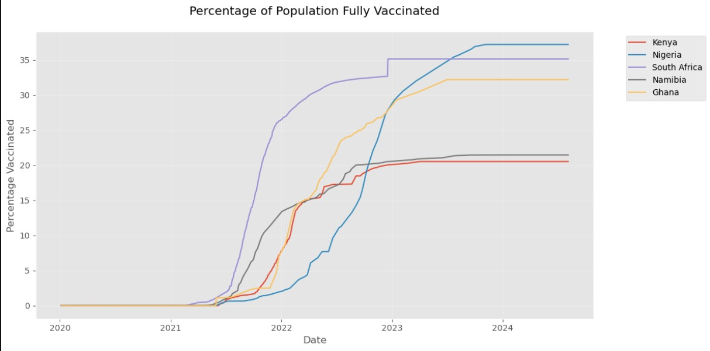

# PLP-Python-COVID-19-Global-Data-Tracker-Project  
## 🌍 Overview  
This Python project analyzes global COVID-19 data to track cases, deaths, and vaccinations.   
Using simple code, it cleans the data, compares countries, and creates easy-to-understand charts  
showing trends over time.It helps visualize the pandemic's impact through line graphs,   
vaccination progress charts, and interactive maps - all with just a few lines of customizable code.   
The project teaches basic data analysis while providing meaningful insights about COVID-19's spread worldwide.   

## 🛠️ Prerequisites  
Before you begin, ensure you have these installed:  
1. Python 3.6+(Download from python.org)  
2. Jupyter Notebook   
   -Install by running what's below on your cmd/bash:  
      pip install notebook  
      Required Python Libraries  
   -Install all dependencies by running:  
      pip install pandas numpy matplotlib seaborn plotly  
   
## 📂 Getting Started...  
1. Clone the Repository  
     -git clone https://github.com/flumadi/PLP-Python-COVID-19-Global-Data-Tracker-Project.git (for me-change to fit yours)  
     -cd covid-data-analysis  
2. Download the Dataset  
     -Get the CSV file from Our World in Data  
     -Save it as owid-covid-data.csv in the project folder  
   or to make work easier use the one present in the repo!!  
3. Run the Analysis  
     -Open Jupyter Notebook:  
     -jupyter notebook  
    Then:  
     -Open covid_analysis.ipynb  
     -Click Run All from the Cell menu  

## 📊 What the Code Does  
🔍 Data Loading & Cleaning  
     *Loads COVID-19 data from CSV  
     *Filters for selected countries  
     *Handles missing data  

## 📈 Key Visualizations  
  Cases Over Time - Line graph showing infection trends  
  Vaccination Progress - Percentage of population vaccinated  
  Death Rate Analysis - Fatalities vs cases over time  
  Global Map - Interactive choropleth of cases worldwide  
Below is a sample of what the visualizations look like...
  
## 💡 Beginner Tips  
✅Changing Countries  
Edit this line to analyze different countries:  
python  
countries = ['Kenya', 'Nigeria', 'South Africa', 'Namibia']  

✅Viewing Data  
Add this cell to peek at the data:  
python  
df.head()  # Shows first 5 rows  

✅Saving Plots  
Right-click any visualization → Save image as...  

## ❓ Getting Help  
If any errors occur:  
  Check all prerequisites are installed  
  Ensure the CSV file is in the right folder  
  Google any error messages - chances are others have solved it!  
## For additional help:  
  Pandas Documentation  
  Matplotlib Tutorials  

## 🚀 NFeel Free To...   
  Try modifying the code to:  
    -Add your country to the analysis  
    -Compare death rates between nations  
    -Create new visualizations  
Prepared by Fridah any questions contact me -mathiasfridah2@gmail.com  
Happy analyzing! 🎉  

